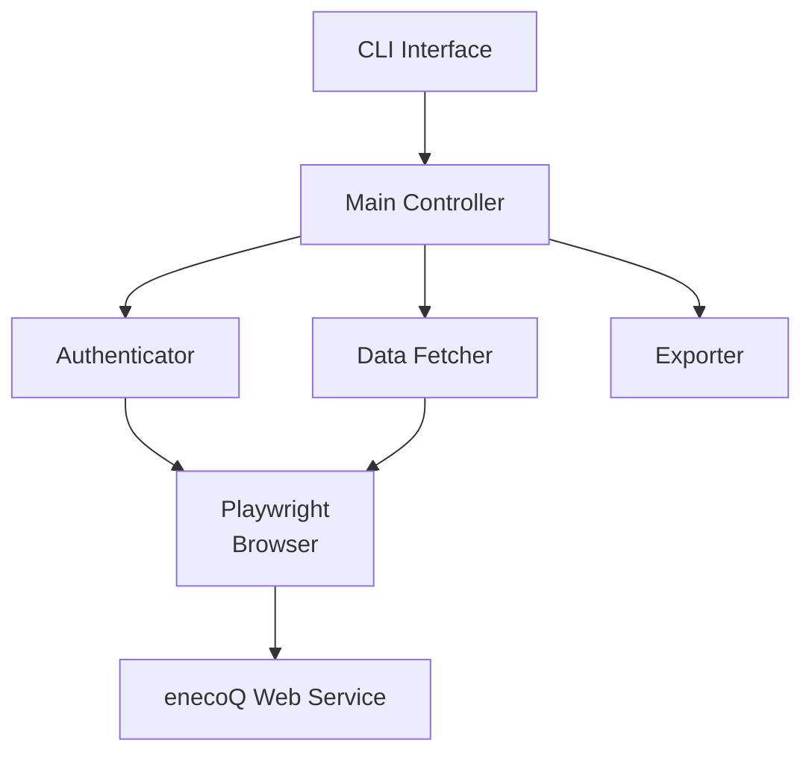

# 設計書

## 概要

本設計書は、enecoQ Web Serviceから電力使用量、電力使用料金、CO2排出量を取得するツールの設計を定義します。enecoQはCYBERHOME（サイバーホーム）の入居者専用ページを通じてアクセスできるサービスであり、公開APIが提供されていないため、Webスクレイピング技術を使用してデータを取得します。

## アーキテクチャ

### システム構成



### 技術スタック

- **プログラミング言語**: Python 3.9+
- **パッケージ管理**: uv（Pythonライブラリ管理）
- **ブラウザ自動化**: Playwright（ブラウザ制御、セッション管理、HTMLパース）
- **CLI フレームワーク**: Click または argparse
- **ログ**: logging（標準ライブラリ）

## コンポーネントと インターフェース

### 1. CLI Interface

コマンドラインインターフェースを提供し、ユーザーからのパラメーターを受け取ります。

**責務**:
- コマンドライン引数のパース
- パラメーターのバリデーション
- Main Controllerの呼び出し
- 結果の表示

**インターフェース**:
```python
def main(
    email: str,
    password: str,
    period: str = "month",  # "today" or "month"
    output_format: str = "json"  # "json" or "console"
) -> int:
    """
    Main entry point for the CLI.
    
    Returns:
        Exit code (0 for success, non-zero for error)
    """
```

### 2. Main Controller

各コンポーネントを統合し、全体のフローを制御します。

**責務**:
- 認証の実行
- データ取得の実行
- データエクスポートの実行
- エラーハンドリング

**インターフェース**:
```python
class EnecoQController:
    def __init__(self, email: str, password: str):
        """Initialize controller with credentials."""
        
    def fetch_power_data(self, period: str) -> PowerData:
        """
        Fetch power data for the specified period.
        
        Args:
            period: "today" or "month"
            
        Returns:
            PowerData object containing usage, cost, and CO2 data
        """
```

### 3. Authenticator

enecoQ Web Serviceへの認証を担当します。

**責務**:
- ログインリクエストの送信
- セッションの管理
- ログイン状態の確認

**インターフェース**:
```python
from playwright.sync_api import Page, BrowserContext

class EnecoQAuthenticator:
    def __init__(self, email: str, password: str):
        """Initialize authenticator with credentials."""
        
    def login(self, page: Page) -> None:
        """
        Authenticate with enecoQ Web Service.
        
        Args:
            page: Playwright page object
            
        Raises:
            AuthenticationError: If login fails
        """
        
    def is_logged_in(self, page: Page) -> bool:
        """Check if the user is still logged in."""
```

### 4. Data Fetcher

enecoQ Web Serviceからデータを取得し、パースします。

**責務**:
- 電力データページへのアクセス
- HTMLレスポンスの取得
- HTMLのパース
- 電力使用量の抽出
- 電力使用料金の抽出
- CO2排出量の抽出
- データの正規化
- HTTPエラーのハンドリング

**インターフェース**:
```python
from playwright.sync_api import Page

class EnecoQDataFetcher:
    def __init__(self, page: Page):
        """Initialize fetcher with Playwright page."""
        
    def fetch_today_data(self) -> PowerData:
        """
        Fetch and parse today's power data.
        
        Returns:
            PowerData object
            
        Raises:
            FetchError: If data retrieval or parsing fails
        """
        
    def fetch_month_data(self) -> PowerData:
        """
        Fetch and parse this month's power data.
        
        Returns:
            PowerData object
            
        Raises:
            FetchError: If data retrieval or parsing fails
        """
```

### 5. Exporter

データを指定された形式でエクスポートします。

**責務**:
- JSON形式への変換
- コンソール表示

**インターフェース**:
```python
class DataExporter:
    def export_json(self, data: PowerData, output_path: str = None) -> str:
        """
        Export data as JSON.
        
        Args:
            data: PowerData object
            output_path: Optional file path to save JSON
            
        Returns:
            JSON string
        """
        
    def export_console(self, data: PowerData) -> None:
        """Display data in console."""
```

## データモデル

### PowerData

電力データを表現するデータクラスです。

```python
from dataclasses import dataclass
from datetime import datetime
from typing import Optional

@dataclass
class PowerUsage:
    """Power usage data."""
    value: float  # kWh
    unit: str = "kWh"

@dataclass
class PowerCost:
    """Power cost data."""
    value: float  # JPY
    unit: str = "円"

@dataclass
class CO2Emission:
    """CO2 emission data."""
    value: float  # kg
    unit: str = "kg"

@dataclass
class PowerData:
    """Complete power data."""
    period: str  # "today" or "month"
    timestamp: datetime
    usage: PowerUsage
    cost: PowerCost
    co2: CO2Emission
    
    def to_dict(self) -> dict:
        """Convert to dictionary for JSON serialization."""
```

### エラークラス

```python
class EnecoQError(Exception):
    """Base exception for enecoQ tool."""
    
class AuthenticationError(EnecoQError):
    """Authentication failed."""
    
class FetchError(EnecoQError):
    """Data fetch failed."""
    
class ParseError(EnecoQError):
    """Data parsing failed."""
    
class ExportError(EnecoQError):
    """Data export failed."""
```

## エラーハンドリング

### エラー処理戦略

1. **認証エラー**
   - 認証情報が不正な場合: `AuthenticationError` を発生させ、エラーメッセージを表示
   - セッション期限切れ: 自動的に再認証を試行（最大3回）

2. **ネットワークエラー**
   - 接続タイムアウト: リトライ（最大3回、指数バックオフ）
   - サーバーエラー（5xx）: リトライ（最大3回）
   - クライアントエラー（4xx）: エラーメッセージを表示して終了

3. **パースエラー**
   - HTML構造が予期しない場合: `ParseError` を発生させ、詳細なエラーメッセージを表示
   - データが見つからない場合: 空のデータセットを返却

4. **エクスポートエラー**
   - ファイル書き込みエラー: `ExportError` を発生させ、エラーメッセージを表示

### ログ戦略

- **ログレベル**:
  - DEBUG: HTTP リクエスト/レスポンスの詳細
  - INFO: 処理の進行状況
  - WARNING: リトライ可能なエラー
  - ERROR: 致命的なエラー

- **ログ出力先**:
  - コンソール: INFO レベル以上
  - ファイル: DEBUG レベル以上（`logs/enecoq.log`）

## テスト戦略

### ユニットテスト

各コンポーネントを独立してテストします。

- **Authenticator**: Playwrightのモックページを使用して認証ロジックをテスト
- **Data Fetcher**: Playwrightのモックページとサンプルコンテンツを使用してデータ取得・パースロジックをテスト
- **Exporter**: データモデルを使用してエクスポートロジックをテスト

### 統合テスト

実際のenecoQ Web Serviceに接続してエンドツーエンドのフローをテストします。

- テスト用の認証情報を環境変数から取得
- 実際のログイン、データ取得、パース、エクスポートを実行
- 取得したデータの妥当性を検証

### テストツール

- **pytest**: テストフレームワーク
- **pytest-playwright**: Playwrightのテストサポート
- **pytest-mock**: モックオブジェクトの作成
- **pytest-cov**: カバレッジ測定

## セキュリティ考慮事項

### 認証情報の管理

- 認証情報はコマンドライン引数から取得
- 認証情報は保存せず、実行時のみメモリ上で使用
- メモリ上の認証情報は使用後に削除

### 通信のセキュリティ

- すべての通信はHTTPS経由で実行
- SSL証明書の検証を有効化
- User-Agentヘッダーを設定して正規のブラウザとして振る舞う

### データの保護

- 取得したデータはローカルに保存する場合、適切なファイルパーミッションを設定
- 機密情報（認証情報）はログに出力しない

## 実装の詳細

### ログインフロー

1. CYBERHOME入居者専用ページ（`https://www.cyberhome.ne.jp/app/sslLogin.do`）にアクセス
2. メールアドレスとパスワードを入力してPOSTリクエストを送信
3. レスポンスからセッションクッキーを取得
4. enecoQページにアクセスしてデータを取得

### データ取得フロー

1. 認証済みセッションを使用してenecoQページにアクセス
2. 期間（今日/今月）に応じて適切にプルダウンを選択
3. ページの読み込みを待機
4. Playwrightを使用してページコンテンツをパース
5. 電力使用量、電力使用料金、CO2排出量を抽出
6. PowerDataオブジェクトを作成して返却

### HTMLパース戦略

- Playwrightの `page.locator()` を使用してCSSセレクターでデータを抽出
- データが見つからない場合は空の値を返却
- 数値データは正規表現を使用して抽出し、floatに変換

### リトライ戦略

```python
import time
from functools import wraps

def retry(max_attempts=3, backoff_factor=2):
    """Retry decorator with exponential backoff."""
    def decorator(func):
        @wraps(func)
        def wrapper(*args, **kwargs):
            for attempt in range(max_attempts):
                try:
                    return func(*args, **kwargs)
                except (ConnectionError, TimeoutError) as e:
                    if attempt == max_attempts - 1:
                        raise
                    wait_time = backoff_factor ** attempt
                    time.sleep(wait_time)
            return None
        return wrapper
    return decorator
```

## 設定管理

### 設定ファイル

設定は `config.yaml` に保存します（オプション）。

```yaml
log_level: INFO
log_file: logs/enecoq.log
timeout: 30
max_retries: 3
user_agent: "Mozilla/5.0 (Macintosh; Intel Mac OS X 10_15_7) AppleWebKit/537.36"
```

### コマンドライン引数

- `--email`: enecoQのメールアドレス（必須）
- `--password`: enecoQのパスワード（必須）
- `--period`: データ取得期間（"today" または "month"、デフォルト: "month"）
- `--format`: 出力形式（"json" または "console"、デフォルト: "json"）
- `--config`: 設定ファイルのパス（デフォルト: "config.yaml"）
- `--log-level`: ログレベル（DEBUG, INFO, WARNING, ERROR、デフォルト: INFO）

## パフォーマンス考慮事項

- HTTPリクエストのタイムアウトを設定（デフォルト30秒）
- セッションの再利用によりTCP接続のオーバーヘッドを削減
- 不要なデータの取得を避けるため、必要なページのみにアクセス
