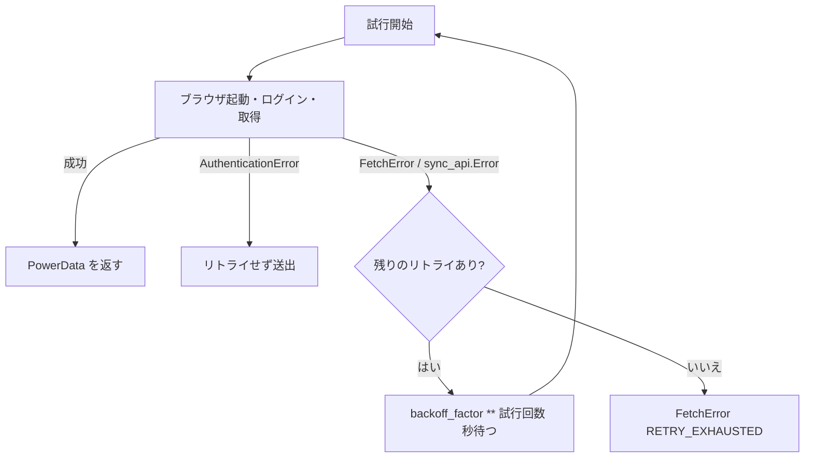

# src/ と scripts/ のリファクター設計

## 目的

`src/enecoq_data_fetcher/` と `scripts/` のバグを直し、重複や使われていないコードを整理する。モジュール構成（`cli` → `controller` → `authenticator` / `fetcher` → `exporter`）は変えない。JSON のキーと CLI の引数は維持する。

作業ツリーにある未コミットのテスト変更（`tests/test_authenticator.py`、`test_cli.py`、`test_config.py`、`test_fetcher.py`、`test_integration.py`）と、`pyproject.toml` / `uv.lock` への PyYAML 追加、`exceptions.py` の書式変更をこの設計の前提とし、そのまま活かす。PyYAML 6.0.3 は 2025-09-25 公開で、OSV-Scanner でも問題は検出されていない。

## 利用者から見える変更

| 項目 | 現在 | 変更後 |
|---|---|---|
| 値が取得できないとき | `0.0` を出力して正常終了 | `FetchError` でリトライし、最終的に終了コード 2 |
| `1,234円` のようなカンマ付きの値 | `1.0` と読む | `1234.0` と読む |
| JSON の `timestamp` | `2024-01-15T10:30:00.123456` | `2024-01-15T10:30:00.123456+09:00`（ローカル時刻のオフセット付き） |
| ログイン中の通信エラーやタイムアウト | リトライせず終了コード 1 | リトライ対象 |
| `user_agent` 設定 | ブラウザに渡らず無効 | ブラウザの context に設定される |
| `max_retries` | 合計の試行回数 | 初回に追加でやり直す回数（デフォルト 3 で最大 4 回） |
| `--config` に存在しないファイルを指定 | 無視してデフォルトで動く | 終了コード 6 |
| 設定ファイルの値が不正 | 型を検証せずに使う | 終了コード 6 |
| PyYAML | 任意（未インストールだと設定ファイルが読まれない） | 必須の依存 |

終了コードの割り当て（1: 認証、2: 取得、3: 出力、4: その他の enecoQ エラー、5: 想定外、6: 引数と設定）は変えない。

## モジュールごとの設計

### authenticator

ログイン情報の誤りと判断できるとき（ログインフォームが見つからない、ログイン後にログアウトリンクが現れない）だけ `AuthenticationError` を投げる。Playwright のエラー（タイムアウトを含む `sync_api.Error`）は包まずにそのまま呼び出し元へ伝える。使われていない `user_agent` 引数は削除する。`is_logged_in` は `sync_api.Error` のときだけ `False` を返す。

### fetcher

`_extract_power_usage` / `_extract_power_cost` / `_extract_co2_emission` を `_extract_value(iframe, alt)` にまとめる。`dt:has(img[alt='...'])` の直後の `dd` のテキストからカンマを除いて数値を読み、要素がない、テキストが空、数値が読めない場合は `FetchError` を投げる。

内側の処理（iframe の特定、期間の選択、値の抽出）は `FetchError` を投げるだけでログに `exc_info` を出さない。`fetch_today_data` / `fetch_month_data` は `FetchError` と `sync_api.Error` を「Failed to fetch today's data: ...」のような期間ごとの `FetchError` に 1 回だけ包み、元の例外を `from` でつなぎ、エラーログもここで 1 回だけ出す。エラーメッセージの値の名前は英語（power usage など）にする。取得時刻は `datetime.datetime.now().astimezone()` とする。

### controller

`playwright` は `from playwright import sync_api` の形で import する。リトライは `_execute_with_retry` の 1 か所にまとめ、ブラウザの起動からやり直す。

試行回数は `max_retries + 1` とする。ブラウザは `sync_playwright()` の中で起動し、`finally` で `browser.close()` を 1 回呼ぶ（context と page も閉じられる）。context は `new_context(user_agent=config.user_agent)` で作り、`timeout` を既定のタイムアウトに設定する。呼ばれていない `_authenticate_with_retry` と未使用の `DEFAULT_*` 定数は削除する。

### config

`Config` の `__post_init__` で値を検証し、`log_level` を大文字にそろえる。

| キー | 条件 |
|---|---|
| `log_level` | DEBUG / INFO / WARNING / ERROR（大文字小文字は問わない） |
| `log_file` | 文字列または未指定 |
| `timeout` | 1 以上の整数（bool は不可） |
| `max_retries` | 0 以上の整数（bool は不可） |
| `user_agent` | 空でない文字列 |

`from_file` は、知らないキー、マッピングでない中身、YAML の構文エラーを `ValueError` にし、空のファイルはデフォルト値とする。`load(config_path=None, log_level=None, log_file=None)` はファイルがなければ `FileNotFoundError` を投げ、引数で渡された値で上書きする。`YAML_AVAILABLE` による分岐は削除する。

### cli

`--config` のデフォルトを `None` にし、未指定のときはカレントディレクトリの `config.yaml` が存在する場合だけ読む。`FileNotFoundError` と `ValueError` は「Config file not found: ...」などのメッセージとともに終了コード 6 にする。`_validate_arguments` は Click の `Choice` と重複する検証を削り、メールアドレスの形式と「`--output` は JSON のときだけ」の 2 つにする。ロガーを設定する前に起きたエラーは `click.echo` で 1 回だけ表示し、ロガーには書かない。

### logger

キーワードで伏せる今の方式をやめ、`setup_logger(log_level, log_file, secrets)` で受け取った実際の値を伏せる。`SensitiveDataFilter(secrets)` は整形後のメッセージに秘密の値が含まれていれば `****` に置き換え、`record.msg` を置き換えた文字列、`record.args` を空にする。フィルターは logger に付け、`setup_logger` を呼ぶたびに既存のハンドラーとフィルターを外して作り直すので重複しない。コンソールのハンドラーは標準エラー出力のままとし、JSON の標準出力と混ざらないようにする。

### exporter と models

exporter は `except (OSError, IOError)` を `except OSError` にまとめる程度にとどめる。models の `PowerUsage` / `PowerCost` / `CO2Emission` は公開されたクラスでテストも依存しているため残す。timestamp のオフセットは fetcher が aware な datetime を渡すことで付き、`to_dict` は変えない。

### scripts/bump_version.sh と Makefile

スクリプトは `set -euo pipefail` とし、リポジトリのルートへ移動してから動く。次の事前確認のどれかに失敗したら何も変更せずに終了する。

1. 作業ツリーとステージングエリアが空である
2. 現在のブランチが `main` である
3. `git fetch origin` のあと `HEAD` が `origin/main` と一致する
4. 現在のバージョンが `X.Y.Z` 形式である
5. 新しいタグ `vX.Y.Z` がローカルにもリモートにも存在しない

バージョンを書き換えたあと `git commit -m "chore: bump version to X.Y.Z" -- src/enecoq_data_fetcher/__init__.py` でそのファイルだけをコミットし、タグを作る。`--push` を付けたときだけ `git push --atomic origin main vX.Y.Z` を実行する。Makefile の `release-patch` / `release-minor` / `release-major` は `./scripts/bump_version.sh <種別> --push` を呼ぶ。

## テスト

作業ツリーのテスト変更はそのまま使い、次を追加する。

- 実際のパスワードが `%s` の引数として渡されてもログで `****` になること（`test_logger.py` の既存フィルターテストは新方式に書き換える）
- JSON の `timestamp` に UTC オフセットが付くこと
- `sync_api.Error` ではリトライされ、`AuthenticationError` ではリトライされないこと、試行回数が `max_retries + 1` であること
- `user_agent` が `new_context` に渡されること
- `bump_version.sh` を一時的な git リポジトリ（ローカルの bare リポジトリを `origin` にする）で動かし、バージョンの更新、`--push` での送信、事前確認のそれぞれで中断すること（他のステージ済みファイルや未追跡ファイルがあるときも中断する）を確かめる

すべて `./tests/run_tests.sh` から実行できるようにし、実装後に `osv-scanner --lockfile=uv.lock` も実行する。

## ドキュメント

README の JSON 例に timestamp のオフセットを反映し、`max_retries` の意味を設定ファイルの説明に追記する。`config.yaml.example` のコメントも同じ意味に合わせる。
